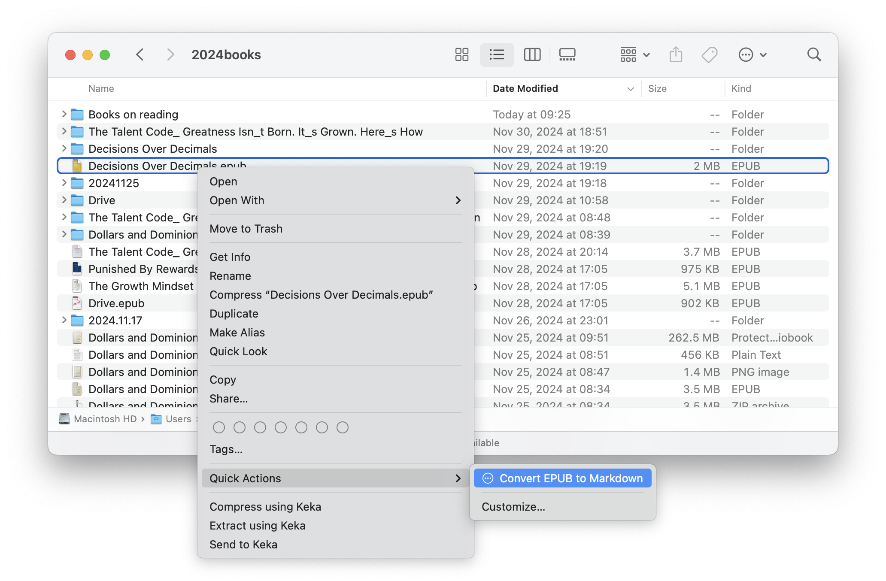
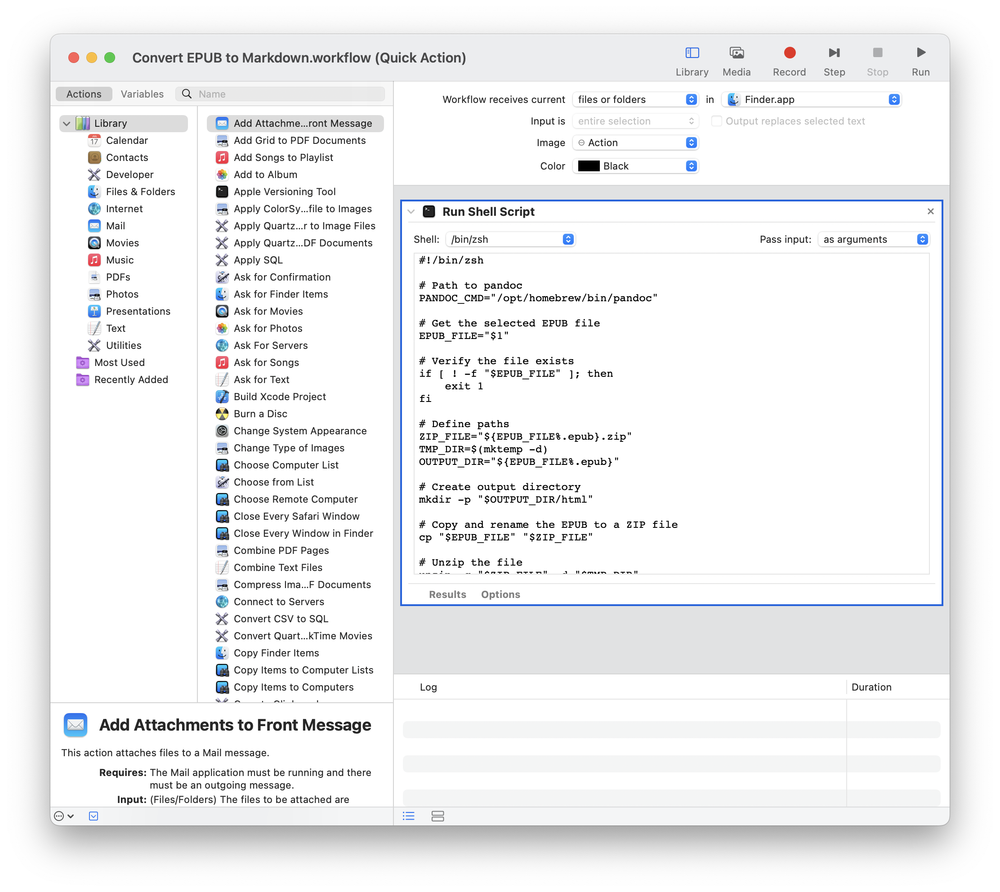

# NotebookLM by Google

[NotebookLM](https://notebooklm.google.com) 是 Google 推出的 “人工智能辅助笔记” 应用。用户上传文档（PDF/TXT/Markdown）至 NotebookLM 后，就可以向文档提问，由 AI 回答。

除此之外，无论是论文还是书籍，NotebookLM 都可以为此生成一个 "Deep Dive Podcast"，大约 30 分钟左右的两人对话语音讲解。

目前（2024 年 12 月）的局限之一是只能用英语才能获得最佳效果。

我的做法是：

> 1. 先在 Kindle 上读完一本书（我觉得这一步绝对不能跳过）；
> 2. 从自己的 [Content Library](https://www.amazon.com/hz/mycd/digital-console/contentlist/booksAll/dateDsc/) 里下载相应的 azw3 文件；
> 3. 使用 ePubor 软件将其转换成 epub 文件（参见[这篇文章](kindle.md)）；
> 4. 【待续……】

我写了一个 Automator Quick Action —— 如此这般之后，在 Finder 里右键点击 epub 文件的时候，会多出一个 `Context Menu: Convert EPUB to markdown`……（



它会把 `epub` 文件转换成一个文件夹，其中有整本书的 `txt` 文件，以及拆分的各个章节的 `markdown` 文件，另外，`epub` 中原本包含的内容，在 `html` 子目录中。

有一个前提：你的系统中安装了 `pandoc` 命令行工具 —— 如果没有的话，可以通过 `brew install` 命令安装。

```bash
brew install pandoc
```

另外，你也需要检查一下系统内置的 `unzip` 是否存在：

```bash
which unzip
```

如果不存在的话，就用 `brew` 安装：

```bash
brew install unzip
```

如果你想要自己用 Automator 写 Quick Action 的话，可以在 Quick Action 里添加以下 Shellscript 内容：

``` bash
#!/bin/zsh

# Path to pandoc
PANDOC_CMD="/opt/homebrew/bin/pandoc"

# Get the selected EPUB file
EPUB_FILE="$1"

# Verify the file exists
if [ ! -f "$EPUB_FILE" ]; then
    exit 1
fi

# Define paths
ZIP_FILE="${EPUB_FILE%.epub}.zip"
TMP_DIR=$(mktemp -d)
OUTPUT_DIR="${EPUB_FILE%.epub}"

# Create output directory
mkdir -p "$OUTPUT_DIR/html"

# Copy and rename the EPUB to a ZIP file
cp "$EPUB_FILE" "$ZIP_FILE"

# Unzip the file
unzip -q "$ZIP_FILE" -d "$TMP_DIR"
if [ $? -ne 0 ]; then
    rm -rf "$TMP_DIR" "$ZIP_FILE"
    exit 1
fi

# Locate the OEBPS folder
OEBPS_DIR=$(find "$TMP_DIR" -type d -name "OEBPS")
if [ -z "$OEBPS_DIR" ]; then
    rm -rf "$TMP_DIR" "$ZIP_FILE"
    exit 1
fi

# Copy all content from OEBPS to the output directory's html folder
cp -R "$OEBPS_DIR"/* "$OUTPUT_DIR/html/"

# Convert HTML files in the OEBPS folder to Markdown
for HTML_FILE in "$OEBPS_DIR"/*.html; do
    if [ -f "$HTML_FILE" ]; then
        BASENAME=$(basename "$HTML_FILE" .html)
        "$PANDOC_CMD" "$HTML_FILE" -o "$OUTPUT_DIR/$BASENAME.md"
    fi
done

# Convert the entire EPUB to a single TXT file
FULL_TXT_FILE="$OUTPUT_DIR/$(basename "${EPUB_FILE%.epub}.txt")"
"$PANDOC_CMD" "$EPUB_FILE" -o "$FULL_TXT_FILE"

# Cleanup
rm -rf "$TMP_DIR"
rm "$ZIP_FILE"

# Notify completion
osascript -e "display notification \"Output saved to: $OUTPUT_DIR\" with title \"EPUB Processor\""
```



你也可以直接下载这个文件：[Convert EPUB to Markdown.workflow](https://raw.githubusercontent.com/xiaolai/apple-computer-literacy/main/files/Convert%20EPUB%20to%20Markdown.zip)，将其保存到 `~/Library/Services` 文件夹中即可。

继续回到 NotebookLM 工作流中：

> 4. 新建一个 Notebook，将整本书的 txt 文件上传，让 NotebookLM 生成 Podcast；
> 5. 在将拆分成各个章节的多个 Markdown 文件添加至这个 Notebook；如此这般之后，就可以 “针对整本书（只选择整本书的文件）” 或者 “只针对某个章节（只选择某个章节的文件）” 提问。

我最常用的几个 Prompt 分别是（主要是针对每个章节提问）：

> * Make an extensive summary of this file.
> * List all scientific findings the author mentioned in this file.
> * List all metaphors and analogies in this file.
> * List all phrasal verbs and idioms in this file, and provide concise Chinese translation of them according to the context.
> * List all less common vocabulary in this file and provide phonetics, part of words, and concise Chinese translation according to the context.
> * Provide a short list of "Further Reading", recommend 5 best related books and scientific papers.
